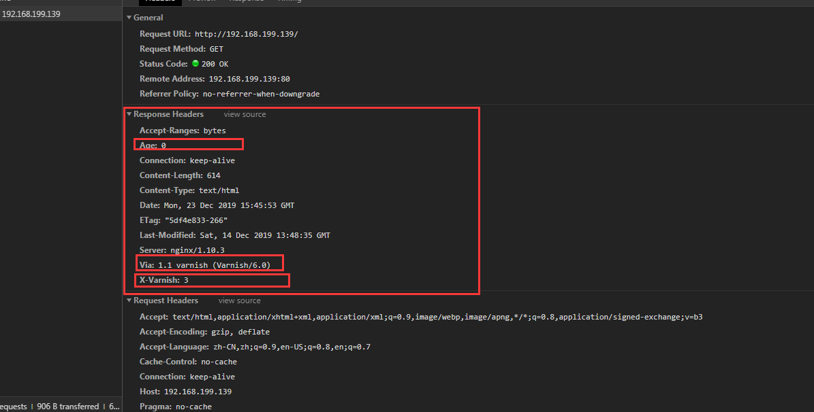

# Varnish环境搭建

 本教程中，采用的是基于源码的方式安装，版本号为varnish-6.0.5版本，下载地址：https://varnish-cache.org/releases/index.html

1. 通过FTP工具上传varnish-6.0.5.tgz到服务器路径/usr/local/zmf下面，并修改后缀为*.tar.gz

   ```
   [root@localhost zmf]# mv varnish-6.0.5.tgz varnish-6.0.5.tar.gz
   ```

   

2. 安装varnish所需要的依赖包

   ```
   [root@localhost zmf]# sudo yum install \
       make \
       autoconf \
       automake \
       jemalloc-devel \
       libedit-devel \
       libtool \
       ncurses-devel \
       pcre-devel \
       pkgconfig \
       python-docutils \
       python-sphinx
   ```

   可选依赖安装

   ```
   yum install graphviz
   yum install git
   ```

3. 执行安装步骤

   ```
   [root@localhost zmf]# tar -zxvf varnish-6.0.5.tar.gz
   [root@localhost zmf]# cd varnish-6.0.5
   [root@localhost varnish-6.0.5]# sh autogen.sh
   [root@localhost varnish-6.0.5]# sh configure
   [root@localhost varnish-6.0.5]# make
   # make check不必担心一两个测试失败。有些测试对时间过于敏感（请告诉我们哪些测试可以解决）。但是，如果其中许多失败，尤其是b00000.vtc测试失败，则说明存在严重错误。如果不弄清楚这一点，您将一事无成。
   [root@localhost varnish-6.0.5]#  make check
   [root@localhost varnish-6.0.5]#  make install
   ```

   注意：在线安装的话，安装后会在/usr/bin/下面，源码离线安装的话，会安装在/usr/local/sbin下面。

   /usr/bin下面的都是系统预装的可执行程序，会随着系统升级而改变。

   /usr/local/bin目录是给用户放置自己的可执行程序的地方，推荐放在这里，不会被系统升级而覆盖同名文件。

4. 安装完成之后，执行如下命令查看varnish的版本号

   ```
   [root@localhost zmf]# /usr/local/sbin/varnishd -V
   varnishd (varnish-6.0.5 revision 3065ccaacc4bb537fb976a524bd808db42c5fe40)
   Copyright (c) 2006 Verdens Gang AS
   Copyright (c) 2006-2019 Varnish Software AS
   ```

5. 启动varnish

   ```
   [root@localhost zmf]# varnishd -f /etc/varnish/default.vcl -s file,/var/varnish_cache,1G \
   -T 127.0.0.1:2000 -a 0.0.0.0:9082
   ```

   各参数的含义如下：

   -f  指定 varnish 的配置文件位置

   -s  指定 varnish 缓存存放的方式，常用的方式有：“-s file,<dir_or_file>,<size>”。

   -T  address:port 设定 varnish 的 telnet 管理地址及其端口

   -a  address:port 表示 varnish 对 http 的监听地址及其端口

6. 可创建软连接到系统服务中

      ```
      [root@localhost zmf]# cd /usr/local/varnish/
      [root@localhost sbin]# ln -s /usr/local/varnish/sbin/varnishd /usr/sbin/
      [root@localhost sbin]# ln -s /usr/local/varnish/bin/* /usr/local/bin        
      ```


7. 拷贝配置文件到/etc/varnish下面去，也可以直接在varnish解压包下面

   ```
   # 配置文件模板拷贝出来用
   [root@localhost varnish-6.0.5]#  cp /usr/local/zmf/varnish-6.0.5/etc/example.vcl /etc/varnish/default.vcl
   ```

8. 实例测试

   ```
	[root@localhost varnish-6.0.5]# cd /etc/varnish
	# 配置后端服务器nginx地址和端口
	[root@localhost varnish]# nano default.vcl 
        backend nginx-1 {
    	    .host = "192.168.199.137";
   	    .port = "80";
        }
   # 启动ngix
   # 切换到另一台主机192.168.199.137
   [root@localhost ~]# cd /usr/local/zmf/nginx/sbin
   [root@localhost sbin]# ./nginx
   ```

    浏览器访问192.168.199.139，出现nginx提示界面，说明访问成功，查看响应头信息。   
   ```
HTTP/1.1 200 OK
   Server: nginx/1.10.3
Date: Mon, 23 Dec 2019 15:45:53 GMT
   Content-Type: text/html
   Content-Length: 614
   Last-Modified: Sat, 14 Dec 2019 13:48:35 GMT
   ETag: "5df4e833-266"
   X-Varnish: 3
   Age: 0
   Via: 1.1 varnish (Varnish/6.0)
   Accept-Ranges: bytes
   Connection: keep-alive 
   
   需要注意的是varnish返回的响应，varnish会增加三个相应头信息，分别是“X-Varnish”、“Via”和“Age”。这些头信息在Varnish的处理过程中非常有用。
   X-Varnish头信息的后面会有一个或两个数字，如果是一个数字，就表明varnish在缓存中没有发现这个请求，这个数字的含义是varnish为这个请求所做的标记ID。如果X-Varnish后是两个数字，就表明varnish在缓存中命中了这个请求，第一个数字是请求的标识ID，第二个数字是缓存的标识ID。
   “Via”头信息表明这个请求将经过一个代理。
   “Age”头信息标识出这个请求将被缓存多长时间（单位：秒）。首次请求的“Age”为0，后续的重复请求将会使Age值增大。如果后续的请求没有是“Age”增加，那就说明varnish没有缓存这个响应的结果
   ```
   
   