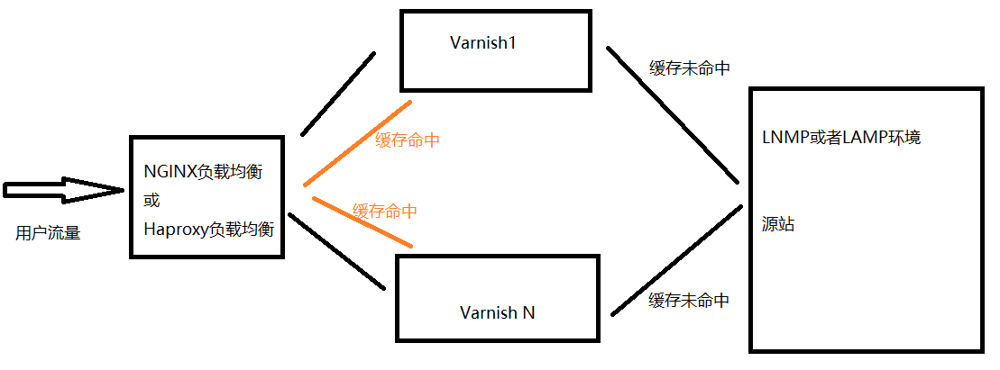

# Varnish CDN集群

一般情况下，会在Nginx或者Haproxy负载均衡层，进行心跳检测和浮动IP，而且会加上健康检测，来避免宕机的危险，正常流程是外网映射内网，内网机器之间实现LVS的VIP功能。

集群搭建拓扑图



流程:  http->反向代理->varnish集群->源站

## 集群环境搭建

系统环境

| 软件    | 版本   |
| ------- | ------ |
| Cenos   | 7.2    |
| nginx   | 1.10.3 |
| Varnish | 6.0.5  |

服务器用途

| 服务器地址      | 用途      |
| --------------- | --------- |
| 192.168.39      | nginx     |
| 192.168.199.138 | nginx     |
| 192.168.199.139 | Varnish   |
| 192.168.199.140 | Varnish   |
| 192.168.199.141 | Web服务器 |

1. nginx和web服务器的环境搭建在这里不在叙述，参看nginx教程文档

2. varnish的环境搭建也不再描述， [参看上一节](./Varnish环境搭建.md)

3. Varnish集群文件配置

   ​        Varnish节点，只需要安装Varnish即可，并按以下进行Varnish节点配置，Varnish（1-N）配置文件一致，唯一不一致的是运行配置文件（即启动命令），运行配置文件需要指定监听Varnish节点外网IP。

   ​       default.vcl文件配置：

>  ```
>  # 后端服务器配置
>  backend default {  
>  	.host = "源站外网IP";  
>  	.port = "8081";             
>  	.connect_timeout = 600s;  
>  	.first_byte_timeout = 600s;  
>  	.between_bytes_timeout = 600s;  
>  	.max_connections = 128;
>  }
>  # 访问控制列表
>  acl purger {   
>  	"localhost";   
>  	"127.0.0.1";
>  }
>  #  接收到浏览器请求后，在处理请求之前调用此函数
>  sub vcl_recv {	
>       # 请求方法如果为purge
>  	if (req.method == "PURGE") {		
>  	     #  如果客户端ip不允许purge
>  		if (!client.ip ~ purger) {			
>  		    return(synth(405, "This IP is not allowed to send PURGE requests."));  	   
>  		}		
>  		return (purge);	
>  	}	
>  	# 如果请求被重写的次数为0
>  	if (req.restarts == 0) {		
>  		if (req.http.X-Forwarded-For) {		
>  			set req.http.X-Forwarded-For = client.ip;  		
>  		}	
>  	}	
>  	if (req.http.Authorization || req.http.Cookie ~ "wordpress_logged" || req.http.Cookie ~ "comment_") {         
>  		/* Not cacheable by default */         	
>  		return (pass);	
>  	}	
>  	if (req.url ~ "/feed") {		
>  		return (pass);	
>  	}	
>  	if (req.url ~ "wp-admin|wp-login") {		
>  		return (pass);	
>  	}	
>  	if (req.url ~ "^(.*)\.(jpg|png|gif|jpeg|flv|bmp|gz|tgz|bz2|tbz|js|css|html|htm)($|\?)" ) {          
>  		#移除cookie,以便能缓存到varnish         
>  		unset req.http.cookie; 	
>  	} 	
>  	   set req.http.cookie = regsuball(req.http.cookie, "wp-settings-\d+=[^;]+(; )?", "");	 set req.http.cookie = regsuball(req.http.cookie, "wp-settings-time-\d+=[^;]+(; )?", "");	
>  	   if (req.http.cookie == "") {		
>  	   	unset req.http.cookie;  	
>  	   }
>  }
>  sub vcl_purge { 	
>  	set req.method = "GET"; 	
>  	set req.http.X-Purger = "Purged";	
>  	return (restart);
>  }
>  sub vcl_backend_response {	
>  	set beresp.ttl = 24h; 	
>  	set beresp.grace = 1h;	
>  	if (bereq.url !~ "wp-admin|wp-login|product|cart|checkout|my-account|/?remove_item=")         {		
>  		 unset beresp.http.set-cookie;	
>  	}
>  }
>  sub vcl_deliver {	
>  	unset resp.http.Via;	
>  	unset resp.http.X-Varnish;	
>  	if (obj.hits > 0) {	
>  		set resp.http.X-Cache =  "HIT from " + server.hostname;	
>  	} else {	
>  		set resp.http.X-Cache =  "MISS from " + server.hostname;	
>  	}
>  }
>  sub vcl_synth {
>  	if (resp.status == 404) {    
>  		set resp.http.Content-Type = "text/html; charset=utf-8";    
>  		set resp.http.Retry-After = "5";    
>  		synthetic( {"<!DOCTYPE html><html>  <head>    <title>"} + 
>  			     resp.status + " " + resp.reason + 
>  			     {"</title>  </head>  <body>    <h1>Error "} + resp.status + " " +                              resp.reason + {"</h1>    <p>"} + resp.reason + 
>  			     {"</p>    <h3>Guru Meditation:</h3>    <p>XID: "} + req.xid + 
>  			     {"</p>    <hr>    <p>Varnish cache server</p>  </body></html>"} );
>  	}    
>  	return (deliver);    
>  }
>  ```

​          启动命令(运行配置文件)

​			如果Nginx负载均衡和Varnish在同台机器，那么Varnish运行配置文件不需要指定IP，默认是127.0.0.1

   > ```
   > /usr/sbin/varnishd -a :6081 -f /etc/varnish/default.vcl -s file,/tmp/varnish/cache.bin,5G 
   > ```

​			Varnish运行配置文件，如果Nginx负载均衡和Varnish不在同台机器，那么Varnish需要指定运行配置文件的外			网IP。

>```
>/usr/sbin/varnishd -a IP:6081 -f /etc/varnish/default.vcl -s file,/tmp/varnish/cache.bin,5G
>```

​            注意：ip也可以具体不指定，直接使用0.0.0.0代替

1. 启动nginx、varnish、web服务器
2. 主机访问nginx配置的web服务器映射地址，查看响应头信息，如果含有Varnish增加的头信息，则说明配置成功
3. 测试Varnish集群是否生效，关闭任意一台Varnish机器，网站正常运行。