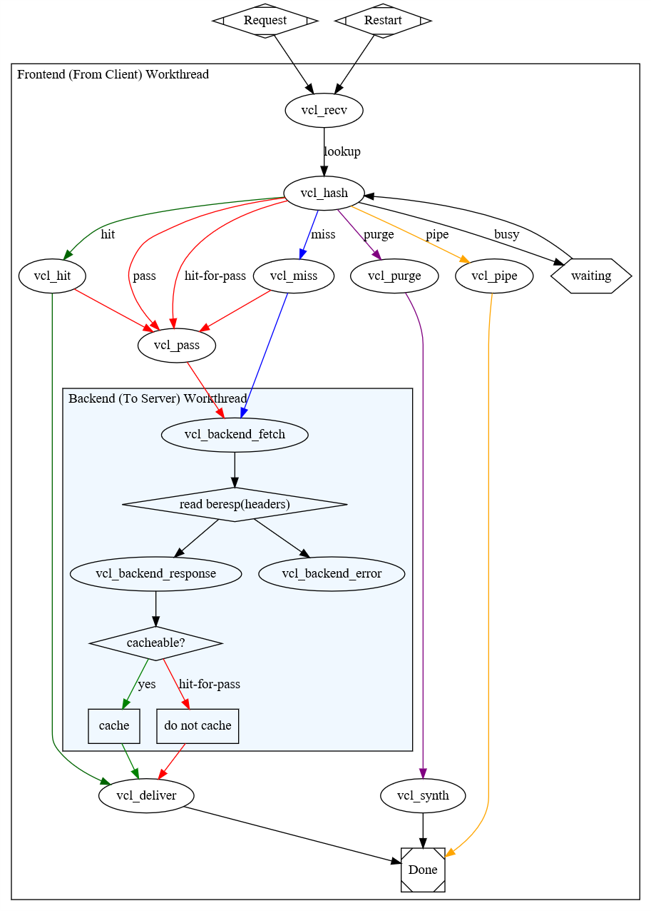

# 五 、VCL

Varnish配置语言（VCL）是一种特定于域的语言，用于描述Varnish Cache的请求处理和文档缓存策略。加载新配置时，由Manager进程创建的VCC进程将VCL代码转换为C.此C代码通常由gcc共享对象编译。然后将共享对象加载到cacher进程中。

varnish的有限状态机：如图所示



VCL有多个状态引擎，状态之间存在相关性，但状态引擎彼此间互相隔离；每个状态引擎可使用return(x)指明关联至哪个下一级引擎；每个状态引擎对应于vcl文件中的一个配置段，即为subroutine（子程序）

俩个特殊的引擎：

```
vcl_init：在处理任何请求之前要执行的vcl代码：主要用于初始化VMODs；
vcl_fini：所有的请求都已经结束，在vcl配置被丢弃时调用；主要用于清理VMODs；
```

#### 1、vainish默认的VCL配置

> 默认VCL配置也叫做隐式规则，在配置文件中无法看到，即使我们修改了配置文件，默认配置规则也是在最后做处理。

```
varnish> vcl.show -v boot  #在客户端cli工具中查看
#  接收到浏览器请求后，在处理请求之前调用此函数
sub vcl_recv {
    if (req.method == "PRI") {  #如果客户端的请求方法是PRI，不支持SPDY或HTTP/2.0
        return (synth(405));  #则构建一个405的包响应给客户端
    }
    if (req.method != "GET" &&  #如果客户端的请求方法不是GET
       req.method != "HEAD" &&  #并且不是HEAD
       req.method != "PUT" &&  #并且不是PUT
       req.method != "POST" &&  #并且不是...
       req.method != "TRACE" &&
       req.method != "OPTIONS" &&
       req.method != "DELETE") {
       return (pipe);  #即，不是标准HTTP请求方法的交给pipe（管道）
    }
    if (req.method != "GET" && req.method != "HEAD") {  #请求方法不是GET和HEAD的
        return (pass);  #交给pass处理，也就是除了GAT和HEAD方法其他的无法缓存
    }
    if (req.http.Authorization || req.http.Cookie) {  #http的请求首部包含Authorization（认证）或Cookie，即个人专有信息
        return (pass);  #交给pass处理，因为这些带有个人信息的数据无法缓存
    }
    return (hash);  #以上的规则都没有做处理的请求交给hash做处理，剩下的是可以查询缓存的请求了
}

sub vcl_pipe
此函数在进入pipe模式时被调用，用于将请求直接传递至后端主机，在请求和返回的内容没有改变的情况下，将不变的内容返回给客户端，直到这个连接被关闭。
sub vcl_pass
此函数在进入pass模式时被调用，用于将请求直接传递至后端主机。后端主机在应答数据后将应答数据发送给客户端，但不进行任何缓存，在当前连接下每次都返回最新的内容。
sub vcl_hash
在vcl_recv之后调用，为请求创建哈希值。用作在Varnish中查找对象的键。
sub vcl_purge
在执行清除并清除所有其变体之后调用。
sub vcl_hit
从缓存中查找到缓存对象时要执行的操作
sub vcl_miss
在执行lookup指令后，在缓存中没有找到请求的内容时自动调用该方法。此函数可用于判断是否需要从后端服务器获取内容。
此函数一般以如下几个关键字结束。
sub vcl_deliver
将在缓存中找到请求的内容发送给客户端前调用此方法。
sub vcl_synth
调用以传递合成对象。在VCL中生成一个合成对象，而不是从后端获取。
sub vcl_backend_fetch
在发送后端请求之前调用。在此子例程中，通常会在到达后端之前更改请求。
sub vcl_backend_response
在读取了后端服务器响应报文后执行
sub vcl_backend_error
如果我们无法通过后端获取或超过max_retries，则调用此子例程。
sub vcl_init
在加载VCL时调用，在任何请求通过之前调用。通常用于初始化VMOD。
sub vcl_fini
仅在所有请求都已退出VCL后才丢弃VCL时调用。通常用于清理VMOD。
```

#### 2、内建函数

- regsub(str, regex, sub)
- regsuball(str, regex, sub)
- ban(boolean expression)
- hash_data(input)
- synthetic(str)
- hash_data()：指明哈希计算的数据；减少差异，以提升命中率
- regsub(str,regex,sub)：把str中被regex第一次匹配到字符串替换为sub；主要用于URL Rewrite
- regsuball(str,regex,sub)：把str中被regex每一次匹配到字符串均替换为sub
- return()
- ban(expression)
- ban_url(regex)：Bans所有的其URL可以被此处的regex匹配到的缓存对象
- synth(status,"STRING")：生成响应报文

#### 3、Keywords

- call subroutine
- return(action)
- new
- set
- unset

#### 4、操作符

- ==, !=, ~, >, >=, <, <=
- 逻辑操作符：&&, ||, !
- 变量赋值：=

**示例1**：obj.hits是内建变量，用于保存某缓存项的从缓存中命中的次数

```
# vim /etc/varnish/varnish.params
VARNISH_LISTEN_PORT=80
# vim /etc/varnish/default.vcl
backend default {
    .host = "192.168.0.9";
    .port = "80";
}
sub vcl_deliver {
    if (obj.hits>0) {
        set resp.http.X-Cache = "HIT via" + " " + server.ip;
    } else {
        set resp.http.X-Cache = "MISS from " + server.ip;
    }
}
# systemctl restart varnish  #谨慎重启varnish服务，会导致之前的缓存失效
# for i in {1..5}; do curl -I -s 192.168.0.8 |grep "X-Cache"; done  #在客户端测试，第一次Miss
X-Cache: MISS from 192.168.0.8
X-Cache: HIT via 192.168.0.8
X-Cache: HIT via 192.168.0.8
X-Cache: HIT via 192.168.0.8
X-Cache: HIT via 192.168.0.8
```

#### 5、内建变量

- req.*：request，表示由客户端发来的请求报文相关；
- bereq.*：由varnish发往BE主机的httpd请求相关；
- beresp.*：由BE主机响应给varnish的响应报文相关；
- resp.*：由varnish响应给client相关；
- obj.*：存储在缓存空间中的缓存对象的属性；只读；

常用变量：

- bereq.request, req.request：请求方法；
- bereq.url, req.url：请求的url；
- bereq.proto：请求的协议版本；
- bereq.backend：指明要调用的后端主机；
- req.http.Cookie：客户端的请求报文中Cookie首部的值；
- req.http.User-Agent ~ "chrome"；
- beresp.status, resp.status：响应的状态码；
- reresp.proto, resp.proto：协议版本；
- beresp.backend.name：BE主机的主机名；
- beresp.ttl：BE主机响应的内容的余下的可缓存时长；
- obj.hits：此对象从缓存中命中的次数；
- obj.ttl：对象的ttl值
- server.ip：varnish主机的IP；
- server.hostname：varnish主机的Hostname；
- client.ip：发请求至varnish主机的客户端IP；

**示例2**：强制对某类资源的请求不检查缓存

```
# vim /etc/varnish/default.vcl
sub vcl_recv {
    if (req.url ~ "(?i)^/(login|admin)") {  #"?i"表示忽略大小写，匹配到url中带有login或admin的不查询缓存
        return(pass);
    }
}
# varnish_reload_vcl
# for i in {1..5}; do curl -I -s http://192.168.0.8/login |grep "X-Cache"; done  #客户端测试
X-Cache: MISS from 192.168.0.8  #全部Miss
X-Cache: MISS from 192.168.0.8
X-Cache: MISS from 192.168.0.8
X-Cache: MISS from 192.168.0.8
X-Cache: MISS from 192.168.0.8
# for i in {1..5}; do curl -I -s http://192.168.0.8/admin |grep "X-Cache"; done
X-Cache: MISS from 192.168.0.8
X-Cache: MISS from 192.168.0.8
X-Cache: MISS from 192.168.0.8
X-Cache: MISS from 192.168.0.8
X-Cache: MISS from 192.168.0.8
# for i in {1..5}; do curl -I -s http://192.168.0.8/ |grep "X-Cache"; done  #其他网页正常查询缓存
X-Cache: MISS from 192.168.0.8
X-Cache: HIT via 192.168.0.8
X-Cache: HIT via 192.168.0.8
X-Cache: HIT via 192.168.0.8
X-Cache: HIT via 192.168.0.8
```

**示例3**：对于特定类型的资源，例如公开的图片等，取消其私有标识，并强行设定其可以由varnish缓存的时长

```
sub vcl_backend_response {
    if (beresp.http.cache-control !~ "s-maxage") {
        if (bereq.url ~ "(?i)\.(jpg|jpeg|png|gif|css|js)$") {
            unset beresp.http.Set-Cookie;
            set beresp.ttl = 3600s;
        }
    }
}
```

**示例4**：在报文首部添加真正的客户端IP，使得后端server可以记录真正客户端来源

```
[root@varnish ~]# vim /etc/varnish/default.vcl
sub vcl_recv {
    if (req.restarts == 0) {  #匹配没有被重写的URL请求，即第一次请求
        if (req.http.X-Forwarded-For) {  #变量存在并且有值则为真
            set req.http.X-Forwarded-For = req.http.X-Forwarded-For + "," + client.ip;  #将真正的client.ip添加到此变量中，用","隔开
        } else {
            set req.http.X-Forwarded-For = client.ip;  #如果变量不存在或值为空，则直接将client.ip赋值与
        }
    }
}
[root@varnish ~]# varnishadm -S /etc/varnish/secret -T 127.0.0.1:6082
varnish> vcl.load conf1 /etc/varnish/default.vcl
varnish> vcl.use conf1
varnish> vcl.list   
available       0 boot
available       0 reload_2018-07-14T09:55:58
active          0 conf1  #当前正在使用的配置
[root@web1 ~]# vim /etc/httpd/conf/httpd.conf
LogFormat "%{X-Forwarded-For}i %l %u %t \"%r\" %>s %b \"%{Referer}i\" \"%{User-Agent}i\"" combined
[root@web1 ~]# systemctl restart httpd
[root@client ~]# for i in {1..5}; do curl -I -s http://192.168.0.8/login |grep "X-Cache"; done #在客户端测试
[root@web1 ~]# tail /var/log/httpd/access_log 
192.168.0.8 - - [14/Jul/2018:09:56:49 +0800] "HEAD /login HTTP/1.1" 301 - "-" "curl/7.29.0"
192.168.0.8 - - [14/Jul/2018:09:56:49 +0800] "HEAD /login HTTP/1.1" 301 - "-" "curl/7.29.0"
192.168.0.8 - - [14/Jul/2018:09:56:49 +0800] "HEAD /login HTTP/1.1" 301 - "-" "curl/7.29.0"
192.168.0.8 - - [14/Jul/2018:09:56:49 +0800] "HEAD /login HTTP/1.1" 301 - "-" "curl/7.29.0"
192.168.0.8 - - [14/Jul/2018:09:56:49 +0800] "HEAD /login HTTP/1.1" 301 - "-" "curl/7.29.0"
192.168.0.7 - - [14/Jul/2018:10:25:11 +0800] "HEAD /login HTTP/1.1" 301 - "-" "curl/7.29.0"
192.168.0.7 - - [14/Jul/2018:10:25:11 +0800] "HEAD /login HTTP/1.1" 301 - "-" "curl/7.29.0"
192.168.0.7 - - [14/Jul/2018:10:25:11 +0800] "HEAD /login HTTP/1.1" 301 - "-" "curl/7.29.0"
192.168.0.7 - - [14/Jul/2018:10:25:11 +0800] "HEAD /login HTTP/1.1" 301 - "-" "curl/7.29.0"
192.168.0.7 - - [14/Jul/2018:10:25:11 +0800] "HEAD /login HTTP/1.1" 301 - "-" "curl/7.29.0"  #拿到了真正客户端IP，而不是之前的varnish服务器的IP
```

**示例5**：访问控制，拒绝curl客户端的访问

```
sub vcl_recv {
    if(req.http.User-Agent ~ "curl") {
        return(synth(403));
    }
}
```

#### 6、缓存对象的修剪：purge

1) 能执行purge操作

```
sub vcl_purge {
    return (synth(200,"Purged"));
}
```

2) 何时执行purge操作

```
sub vcl_recv {
    if (req.method == "PURGE") {
        return(purge);
    }
    ...
}
```

**示例6**：清除指定缓存

```
[root@varnish ~]# vim /etc/varnish/default.vcl
acl purgers {
    "127.0.0.0"/8;
    "192.168.0.0"/24;
}
sub vcl_recv {
    if (req.method == "PURGE") {
        if (!client.ip ~ purgers) {
            return(synth(405,"Purging not allowed for " + client.ip));
        }
        return(purge);
    }
}
varnish> vcl.load conf3 /etc/varnish/default.vcl
varnish> vcl.use conf3
[root@client ~]# curl -I http://192.168.0.8/
X-Cache: HIT via 192.168.0.8
[root@client ~]# curl -I -X "PURGE"  http://192.168.0.8/
[root@client ~]# curl -I http://192.168.0.8/
X-Cache: MISS from 192.168.0.8
```

#### 7、缓存对象的修剪：Banning

1）varnishadm： `ban   `

```
varnish> ban req.url ~ (?i)^/javascripts
```

2）在配置文件中定义，使用ban()函数

```
sub vcl_recv {
    if (req.method == "BAN") {
        ban("req.http.host == " + req.http.host + " && req.url == " + req.url);  #将规则拼接起来传递给ban函数
        return(synth(200, "Ban added"));
    }
}
# curl -I -X "BAN" http://192.168.0.8/javascripts/
```
