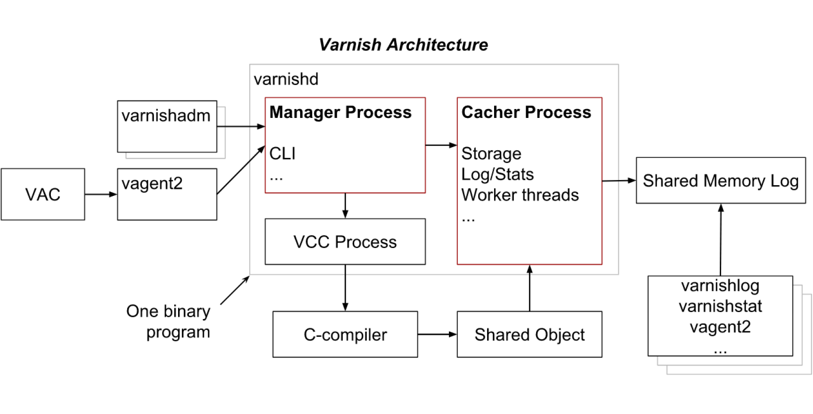

# Varnish理论

## 一、Varnish介绍

Varnish cache，或称Varnish，是一套高性能的反向网站缓存服务器（reverse proxy server）
varnish官方站点： http://www.varnish-cache.org/



> varnish拥有俩套配置文件；一套配置文件用于varnish自身进程的参数配置，另一套用于定义缓存规则；定义缓存规则需要使用灵活的语言来定义，这就是VCL（varnish语言）；应用时需要将VCL编写的规则送给VCC编译后才能运行，所以安装varnish需要依赖gcc编译器。

varnish的安装：

```
在线安装：`yum install varnish -y`，依赖epel源，目前CentOS7的epel源提供的版本是v4.0.5
压缩包安装： 官网下载varnish-xxx.tgz,然后解压安装
```

varnish的程序环境：

注意：不同的安装方式，安装成功后，是存在区别的。

​		源码压缩包离线安装：安装后，命令文件在/usr/lcoal/sbin下面，配置文件在解压包下面，只能通过命令varnishd启动

​        yum在线安装：安装后，命令文件在/usr/sbin下面，配置文件在/etc/varnish下面，有系统服务varnish，可以通过系统服务启动方式启动

- `/etc/varnish/varnish.params`： 配置varnish服务进程的工作特性，例如监听的地址和端口，缓存机制

- `/etc/varnish/default.vcl`：配置各Child/Cache线程的缓存策略

- `/usr/sbin/varnishd`：主程序

- `/usr/bin/varnishadm`：命令行工具

- `/usr/bin/varnishhist`：读取varnishd共享内存日志

- `/usr/bin/varnishlog`：查看内存中的日志

- `/usr/bin/varnishncsa`：以NCSA格式查看日志

- `/usr/bin/varnishstat`：查看缓存日志状态信息

- `/usr/bin/varnishtop`：以rank方式查看日志

- `/usr/bin/varnishtest`：测试工具程序

- `/usr/sbin/varnish_reload_vcl`：VCL配置文件重载程序

- `/usr/lib/systemd/system/varnish.service`：varnish服务

- `/usr/lib/systemd/system/varnishlog.service`：日志持久的服务

- `/usr/lib/systemd/system/varnishncsa.service`：日志持久的服务

 ## 二、管理工具

#### 1、varnishd

- -s [name=]type[,options] ：定义缓存数据的存储方式
  - malloc[,size]：内存存储，[,size]用于定义空间大小；重启后所有缓存项失效
  - file[,path[,size[,granularity]]]：磁盘文件存储，黑盒；重启后所有缓存项失效
  - persistent,path,size：文件存储，黑盒；重启后所有缓存项有效；实验阶段，不建议使用
- -a address[:port][,address[:port][...]：服务监听端口，默认为6081端口
- -T address[:port]：管理服务监听端口，默认为6082端口
- -f config：VCL配置文件
- -F：运行于前台
- -p param=value：设定运行参数及其值； 可重复使用多次
- -r param[,param...]: 设定指定的参数为只读状态

#### 2、varnishstat

```
# varnishstat -1 -f MAIN.cache_hit -f MAIN.cache_miss #显示指定参数的当前统计数据
# varnishstat -l -f MAIN -f MEMPOOL #列出指定配置段的每个参数的意义
```

#### 3、varnishtop

- -1：打印统计信息一次并退出，而不是持续更新的显示
- -i taglist：可以同时使用多个-i选项，也可以一个选项跟上多个标签
- -I <[taglist:]regex>：对指定的标签的值基于regex进行过滤
- -x taglist：排除列表
- -X <[taglist:]regex>：对指定的标签的值基于regex进行过滤，符合条件的予以排除

#### 4、varnishadm

```
# varnishadm -S /etc/varnish/secret -T 127.0.0.1:6082 #登录管理程序
help [<command>] 获取帮助
ping [<timestamp>] 测试服务器
auth <response>
quit 退出cli
banner
status 显示状态
start 启动
stop 停止
vcl.load <configname> <filename> 加载VCL配置文件
vcl.inline <configname> <quoted_VCLstring>
vcl.use <configname> 激活VCL配置文件
vcl.discard <configname> 删除VCL配置
vcl.list 列出VCL配置
param.show [-l] [<param>] 列出当前运行的参数
param.set <param> <value> 运行参数临时调整
panic.show
panic.clear
storage.list 列出数据存储信息
vcl.show [-v] <configname> 列出VCL详细配置
backend.list [<backend_expression>] 列出后端服务器
backend.set_health <backend_expression> <state>
ban <field> <operator> <arg> [&& <field> <oper> <arg>]...
ban.list
```

### 四、配置文件

默认配置文件：

```
RELOAD_VCL=1
VARNISH_VCL_CONF=/etc/varnish/default.vcl  #指定加载VCL配置文件
VARNISH_LISTEN_ADDRESS=192.168.1.5  #服务监听的地址
VARNISH_LISTEN_PORT=6081  #默认监听端口
VARNISH_ADMIN_LISTEN_ADDRESS=127.0.0.1  #管理服务监听的地址
VARNISH_ADMIN_LISTEN_PORT=6082 #管理服务监听的端口
VARNISH_SECRET_FILE=/etc/varnish/secret  #连接秘钥
VARNISH_STORAGE="malloc,256M"  #用内存提供保存缓存,大小为256M
VARNISH_USER=varnish  #用户身份
VARNISH_GROUP=varnish #组身份
DAEMON_OPTS="-p thread_pool_min=5 -p thread_pool_max=500 -p thread_pool_timeout=300" #指定进程的运行参数
```